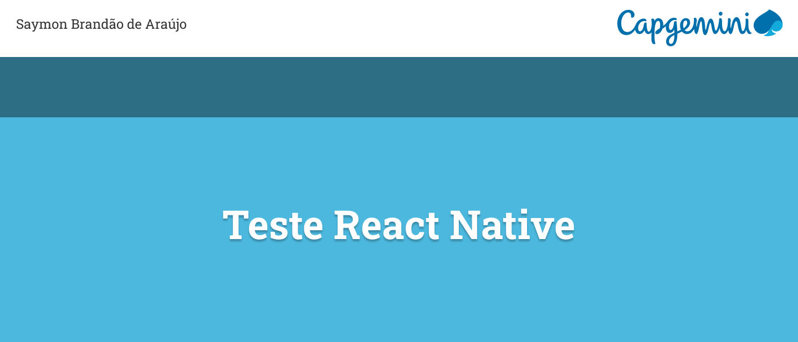
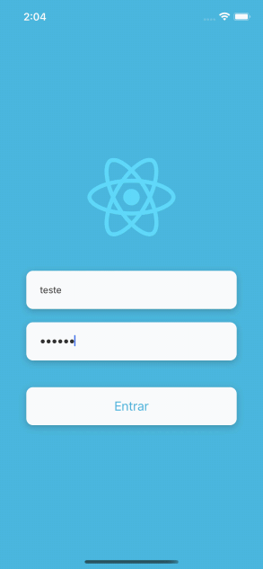

<h1 align="center">
    
</h1>

<h3 align="center">📱 Segunda questão do teste de seletiva para desenvolvedor React Native na Capgemini</h3>

<p align="center">
  
</p>

<p align="center">
 <a href="# white_check_mark-features">Features</a> • 
 <a href="# hammer_and_pick-tecnologias">Tecnologias</a> • 
 <a href="# information_source-como-usar">Como usar</a> • 
 <a href="# memo-licença">Licença</a>
</p>

<br>
<br>

# :white_check_mark: Features

- [x] Login/Logout
- [x] Listagem de produtos
- [x] Filtro de pesquisa
- [x] Detalhes do produto

<p align="center">
  
</p>

<br>

# :hammer_and_pick: Tecnologias

Esse projeto foi desenvolvido utilizando as seguintes tecnologias:

- [React Native](https://reactnative.dev/docs/getting-started)

- [Axios](https://github.com/axios/axios)

- [React Navigation](https://reactnavigation.org/docs/getting-started)

- [React Native NetInfo](https://www.npmjs.com/package/@react-native-community/netinfo)

- [React Native Vector Icons](https://github.com/oblador/react-native-vector-icons)

- [React Native Responsive Fontsize](https://www.npmjs.com/package/react-native-responsive-fontsize)

- [React Native Gesture Handler](https://docs.swmansion.com/react-native-gesture-handler/docs/)

- [React Native Iphone X Helper](https://github.com/ptelad/react-native-iphone-x-helper)

- [React Native Skeleton Placeholder](https://www.npmjs.com/package/react-native-skeleton-placeholder)

- [VS Code](https://code.visualstudio.com/)
  <br>
  <br>

# :information_source: Como usar

```bash
# Clone esse repositório
$ git clone https://github.com/saymon-araujo/capgemini-techinal-test

# Navegue até a pasta do repositório
$ cd capgemini-techinal-test

# Instale as dependencias
$ npm install
$ yarn add

# Execute o app (Android)
$ yarn android

# Execute o app (iOS)
$ yarn ios

# Login
 Email: teste
 Senha: 123456
```

<br>
<br>

# :memo: Licença

Esse projeto está sobre a licença MIT. Veja a [LICENÇA](https://github.com/saymon-araujo/capgemini-techinal-test/blob/main/LICENSE) para mais informações.

---

Feito por Saymon Araújo, 👋 [Entre em contato!](https://www.linkedin.com/in/saymon-araujo/)
